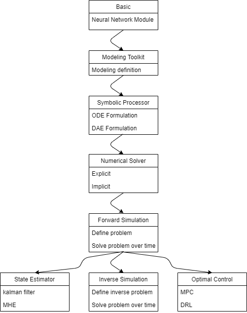

# DiffBuildings
This repo implements a differentiable simulator for building energy systems to support forward simulation, parameter inference and optimal control.

# Software Architecture

1. NeuralNetwork: a deep-learning framework based parametric programming module, e.g., pytorch, Flax etc.
2. DataLoader: prepare dynamic system data to trainable and testable data format
3. ModelingTookit: equation-based modeling tool
4. Compiler: compile models to ODE/DAE systems in pure mathematical representation
5. System: define unified system representation based on ODEs/DAEs, such as ODESystem, DAESystem, NeuralODESystem, ..., etc
6. NumericalSolver: define ODE/DAE integration solvers for solving dynamic systems that are typically represented as differential (algebriac) equations.
7. Problem: define a trainable problem, such as forward simulation, inverse simulation, implicit MPC, explicit MPC, model-based DRL, ..., etc
8. Optimizer: define an optimizer for the trainable problem, such as gradient descent
9. Trainer: define a training/learning process for a specific problem
10. TestCases: define some basic test cases to benchmark testing performance

## JAX implementation

### Toochain
- Jax for basic auto-diff operations
- Diffrax for numerical differentiable equation solvers in JAX
- Sympy2jax for differential equation modeling in JAX
- pydae using sundials
- jax examples: https://ericmjl.github.io/dl-workshop/02-jax-idioms/02-loopy-carry.html

## Julia implementation

### Toolchain
- Flux.jl
- DifferentialEquation.jl
- Optimization.jl

# Applications
## Forward Simulation

## Deterministic Parameter Inference

## Bayesian Inference
- Probablistic Programming 
- Bayesian calibration
- Bayesian optimization -> for control what is this?

## MPC -> stotistical MPC

## Model-based DRL

# Contact

Yangyang Fu

fuyy2008@gmail.com
