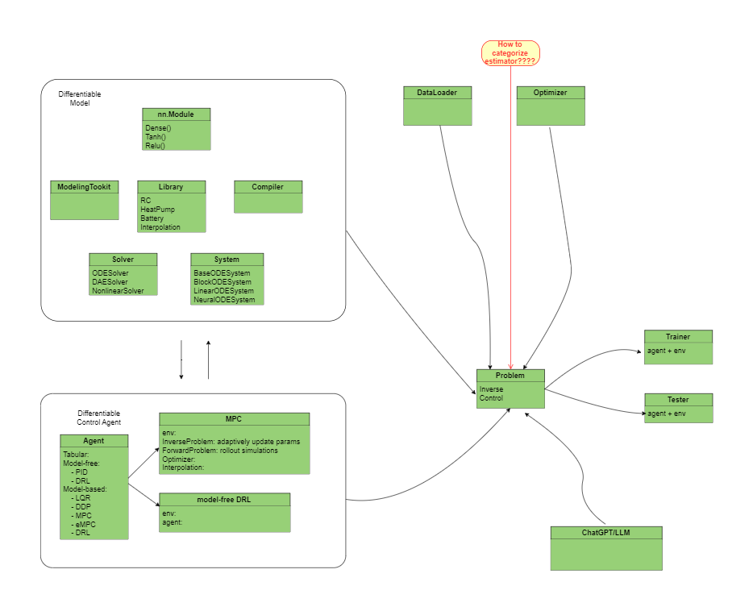

# Dynax

Dynamic system in Jax (Dynax): This repo implements a differentiable simulator for building energy systems to support forward simulation, parameter inference and optimal control.

**NOTE**
This library is still under active development. The APIs are not fully available yet.


This library solves the following general problem:

$$
\dot x_t = f_{xx} x_t + f_{xu} u_t
$$

$$
y_{t} = f_{yx} x_t + f_{yu} u_t
$$

or even more general format as

$$
\dot x_t = f_x(x_t, u_t)
$$

$$
y_t = f_y(x_t,u_t)
$$


The discrete format is shown as:

$$
x_{t+1} = f_{xx}x_t + f_{xu}u_t 
$$

$$
y_{t} = f_{yx}x_t + f_{yu}u_t
$$


# Software Architecture


1. NeuralNetwork: a deep-learning framework based parametric programming module, e.g., pytorch, Flax etc.
2. DataLoader: prepare dynamic system data to trainable and testable data format
3. ModelingTookit: equation-based modeling tool
4. Compiler: compile models to ODE/DAE systems in pure mathematical representation
5. System: define unified system representation based on ODEs/DAEs, such as ODESystem, DAESystem, NeuralODESystem, ..., etc
6. NumericalSolver: define ODE/DAE integration solvers for solving dynamic systems that are typically represented as differential (algebriac) equations.
7. Problem: define a trainable problem, such as forward simulation, inverse simulation, implicit MPC, explicit MPC, model-based DRL, ..., etc
8. Optimizer: define an optimizer for the trainable problem, such as gradient descent
9. Trainer: define a training/learning process for a specific problem
10. TestCases: define some basic test cases to benchmark testing performance

## JAX implementation

### Toochain
- Jax for basic auto-diff operations
- Diffrax for numerical differentiable equation solvers in JAX
- Sympy2jax for differential equation modeling in JAX
- pydae using sundials
- jax examples: https://ericmjl.github.io/dl-workshop/02-jax-idioms/02-loopy-carry.html

## Julia implementation


### Toolchain
- Flux.jl
- DifferentialEquation.jl
- Optimization.jl

# Applications
## Forward Simulation

## Deterministic Parameter Inference

## Bayesian Inference
- Probablistic Programming 
- Bayesian calibration
- Bayesian optimization -> for control what is this?


## Optimal Control

### Dynamic Programming


### LQR


### MPC

The example shew with large RC, the first-order gradient method that requires tuning cannot generate sufficient precooling control sequence, which is counter-intuitive. 


#### Implicit MPC


#### Explicit MPC


### DRL

#### Model-based DRL to Support Value Iteration


#### Explicit Optimization Policy-based DRL

check the paper at https://web.stanford.edu/~boyd/papers/pdf/learning_cocps.pdf

and 

```
B. Amos, I. Jimenez, J. Sacks, B. Boots, and J. Z. Kolter. Differentiable MPC for endto-
end planning and control. In Advances in Neural Information Processing Systems,
pages 8299{8310, 2018.
```

```
M. Okada, L. Rigazio, and T. Aoshima. Path integral networks: End-to-end differentiable
optimal control. arXiv preprint arXiv:1706.09597, 2017.
```

# Use Cases (in design)
## Base Model

RRN-style implementation of Base Model
- [] add description
   
## Model Definition (ODE format representation)
Define a model with ODE format. It could be a pure-physics based model or a neural ODE.

```python
class Model(BaseSSM):
    param_initializer

    def setup(self):
        """ set up ode format here 
        """
        self.params = self.param('p1', initializer=self.param_initializer(), ...)
        self._fxx = fxx()
        self._fxu = fxu()
        self._fyx = fyx()
        self._fyu = fyu()
        self._fx = fx()
        self._fy = fy()

    def __call__(self, inputs):
        # rearrange inputs for hidden states, and inputs
        x, u = split(inputs)
        # return 
        return super().__call__(x, u)

    class fxx(nn.Module):
        ...
    class fxu(nn.Module):
        ...
    class fyx(nn.Module):
        ...
    class fyu(nn.Module):
        ...
    class fx(nn.Module):
        ...
    class fy(nn.Module):
        ...

```

## Differentiable Simulator
This defines a simulator with given model. It should generate results for a given time period with given inputs.

```python
class Simulator(BaseSimulator):
    
    model: nn.Module
    dt: float

    def __call__(self, states, inputs):

        def rollout(model, carry, scan):
            """ A rollout function for multi-steps simulation
            """
            ...
            x, y = model(inputs)
            ...
            return carry, (x, y)
        
        scanned_rollout = nn.scan(rollout, ....)
        carry_init = x0
        steps_for_scan = jnp.arange(ts, te, self.dt)
        _, (xsol, ysol) = scanned_rollout(self.model, carry_init, steps_for_scan)

        return xsol, ysol

```


## Forward Simulation with given control sequences
This is an example to simulate cases where the control inputs are predefined over time as an external file, such as csv. 
This case is typical for inverse inference of a given model using existing data.

There could be two ways to perform forward simulation. One is using functional programming as follows.

```python
from dynax.agents import Tabular
from dynax.models import BaseModel
from dynax.simulators import BaseSimulator

# define a dynamic model
class Model(BaseModel):
    ...

    def __call__(self, inputs):
        ...
        return super().__call__()

# define a simulator for the model
class Simulator(BaseSimulator):
    ...

# define simulation settings
ts = 0
te = 10
dt = 1.0

# given control and disturbance 
t, u = np.linspace(ts, te, 100), np.random.rand(100,2)
t, u = np.linspace(ts, te, 100), np.random.rand(100,4)
# implement a gather function to create inputs for dynamical model
inputs = gather(t, u,d)

# specify model
ode = Model(...)

# specifying a simulator
ds = Simulator(model=ode, dt=dt, ...)

# simulate the system
init_params = ds.init(jax.random.PRNGKey(0), inputs, ...)
xsol, ysol = ds.apply(init_params, inputs)

```

The other approach is to formulate the forward problem as a neural network layer.

```python
class Forward(nn.Module):
    simulator: BaseSimulator

    def __call__(self, inputs, ts, te, ...):
        
        xsol, ysol = self.simulator(inputs, ts, te)

        return xsol, ysol
# specify differentiable simulator
model = Model(...)
simulator = Simulator(...)
# formulate forward problem
forward = Forward(...)

# solve forward problem
init_params = forward.init(jax.random.PRNGKey(0), inputs, ts, te, ...)
xsol, ysol = forward.apply(init_params, inputs, ts, te, ...)

```

## Forward Simulation with Feedback Control
Functional programming:

```python
from dynax.agents import PID

# specify model and simulator instance
model = Model(...)
simulator = Simulator(...)
policy = PID(...)

# experiment settings
ts = 0
te = 10
dt = 1

## simulation loop
y_init = ...
yt = y_init

# initialze simulator
init_params = simulator.init(....)

while t < te:
    # reference signal
    ys = reference(t)
    # control signal from policy
    ut = policy(yt, ys)
    # other inputs 
    dt = disturbance(...)

    # gather for model inputs
    inputs_t = gather(ut, dt, ...)

    # step
    xt, yt = simulator.apply(init_params, inputs, t, t+dt)

    # update step
    t += dt

```

Forward simualtion with closed loop control as a neural network layer

- [] add design

## Inverse Simulation

The inverse simulation can be formulated base on a learnable forward problem.
Here take as an example a calibration problem

```python
from dynax.dataloader import DataLoader
from dynax.agents import Tabular
from dynax.optimizers import GradientDescent
from dynax.trainers import Trainer
from dynax.trainers import TrainStates

# define a forward problem first
forward = Forward(...)

# define states for inverse problem
class InverseTrainStates(TrainStates):
    parameter_lb
    parameter_ub

# define an optimizer
optim = GradientDescent()

# create train states
train_states = InverseTrainStates.create(
    forward = forward.apply,
    params = params_init,
    tx = optim, 
    ...
)

# load train and test data
data_loader = DataLoader(...)
train_ds = data_loader.train
test_ds = data_loader.test


# train step
@jax.jit
def train_step(train_state, ..., target):
    
    # define a loss function for calibration
    def loss_fn(params):
        y_pred = train_state.forward(params, ...)
        error = jnp.sum((target - y_pred)**2)

        regularizer = (...)
        return error + regularizer

    loss, grads = jax.value_and_grad(loss_fcn)(train_state.params)
    train_state = train_state.apply_gradients(grads=grads)

    return loss, grads, train_state

# specify a gradient descent optimizer
optimizer = GradientDescent()

# training
n_epochs = 100
for epoch in range(n_epochs):
    for (x, target) in train_ds:
        loss, grads, train_state = train_step(train_state, ..., target)

# final parameters
params_final = train_state.params

```

## Gym Wrapper
This is to develop a general OpenGym-like API for the communication between control algorithms and differentiable simulator.

The Gymwrapper library should have a minimal interface like this.
```python
class Space():
    ...

class Discrete(Space):
    ...

class Box(Space):
    ...

class Dict(Space):
    ...

class Tuple(Space):
    ...

class EnvStates():
    ...

class Env():
    model: nn.Module

    def step(params, action) -> Tuple():
        
        y = self.model()

        return obs, state, reward, done, truncated, info
    
    def reset():
        """ reset simulator initial states
        """
        ...
        
        return obs, state

    @property
    def name() -> str:
        ...
    @property
    def num_actions() -> int:
        ...
    
    def action_space():
        ...
    
    def observation_space():
        ...
    
    def state_space():
        ...
    
    def reward_func():
        ...

def make():
    ... 

def register():
    ...
```

To instantiate the Gym environment, we can use the following standard way:

```python

# instantiate env
env, env_params = make(id, ...)

# reset env
obs, state = env.reset(...)

# sample an action
action = env.action_space(...).sample(...)

# perform a step
obs, state, reward, terminate, truncated, info = env.step(...)

# jittable 

# vectorized env
venv_params = nn.vmap(env.reset, in_axes=...)
nn.vmap(env.step, in_axes=...)

```


## Optimal Control: MPC

```python
from dynax.dataloader import DataLoader
from dynax.agents import MPC
from dynax.utils import LinearInterpolation
from dynax.estimators import LeastSquareEstimator
from dynax.systems import LinearODESystem
from dynax.solvers import Euler
from dynax.problems import InverseProblem
from dynax.optimizers import GradientDescent
from dynax.trainers import Trainer
from dynax.trainers import TrainStates

import gymnasium as gym
from envs import building

# load data
data_loader = DataLoader()
data_loader.load_data('data/linear_ode.csv')

# specify a piecewise constant control/disturbance agent
disturbance = LinearInterpolation(data_loader.t, data_loader.d)

# specify a linear ODE system
lode = RCModel()

# specify a numerical solver
solver = Euler()

# specify a simulator
ds = Simulator(lode, solver)

# specify a least square estimator
estimator = LeastSquareEstimator()

# loss function
def loss_fn(y, y_hat):
    return np.sum((y - y_hat)**2)

# specify a gradient descent optimizer
optimizer = GradientDescent()

# specify an implicit MPC control problem
mpc_problem = ImplicitMPCProblem(ds, estimator, params, loss_fn, data_loader, optimizer)

# specify a virtual environment with measurement nosie if possible
env = gym.make('building-v0')

# specify a trainer
trainer = Trainer(mpc_problem, env)

# train the model
trainer.train(data_loader)

# test the model
tester = Tester(mpc_problem, env)
tester.test(data_loader)

```

## Optimal Control: DRL

```python
from dynax.agents.drls.offpolicy import DDQN

```


# Contact

Yangyang Fu

fuyy2008@gmail.com
